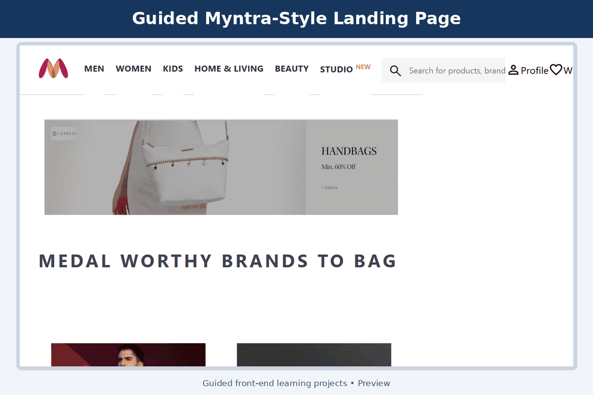
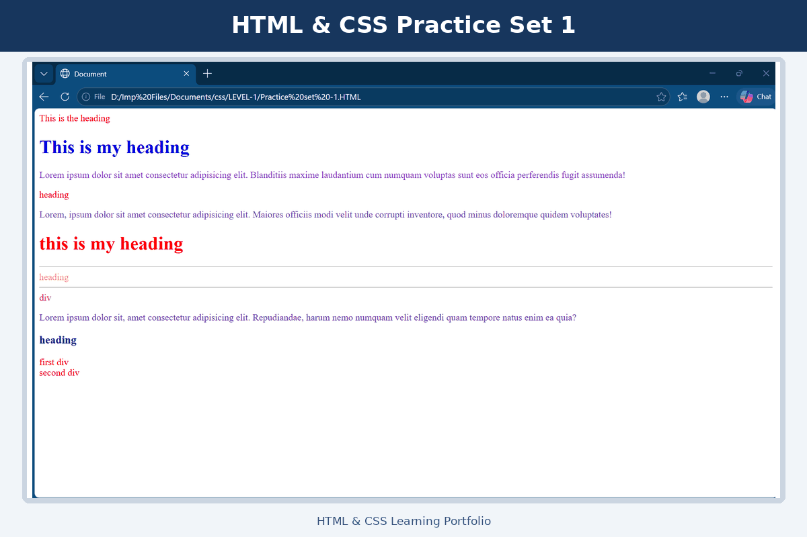

# 🌐 HTML & CSS Learning Projects

A collection of beginner HTML and CSS exercises created while learning front-end web development. The repository covers core HTML elements, forms, CSS selectors, layouts, responsive units, transitions, animations, and a guided Myntra-style landing-page exercise.

> These are learning and practice exercises. Some examples were completed by following lessons and guidance; they are not presented as original production applications.

## 📚 Topics Practised

### HTML Fundamentals

- Headings, paragraphs, links, images, and text formatting
- Lists, tables, forms, checkboxes, and radio buttons
- Semantic elements such as `header`, `main`, `section`, `article`, and `footer`
- Embedded content and basic page structure

[View HTML fundamentals](html/)

### CSS Fundamentals

- Inline, internal, and external CSS
- Element, class, ID, group, and descendant selectors
- Width, height, backgrounds, margins, and padding
- Display properties and relative units
- Flexbox, positioning, pseudo-classes, transforms, transitions, and animations

[View CSS learning exercises](LEVEL-1/)  
[View intermediate CSS exercises](LEVEL-2/)

## 🚀 Frontend Project Slideshow

<p align="center">
  
</p>

This slideshow presents my guided Myntra-style landing page, Bootstrap learning project, and Tailwind CSS learning project.

> These are guided front-end learning projects created for educational practice.

---

<p align="center">
  <a href="https://shreya-88.github.io/Html/">
    
  </a>
  <a href="LEVEL-2/LEVEL-8/Project%20Myntra%20Clone%20.html">
    
  </a>
  <a href="LEVEL-2/LEVEL-8/Index.css">
    
  </a>
</p>

## 🖼️ HTML & CSS Practice Slideshow

<p align="center">
  
</p>

The slideshow presents Practice Sets 1–7 covering HTML elements, CSS selectors, layouts, positioning, Flexbox, transitions, and animations.

## 🛍️ Guided Myntra-Style Landing Page

A front-end learning exercise that recreates parts of an e-commerce landing page using HTML and CSS.

- **Tools:** HTML and CSS
- **Features:** Navigation bar, search interface, promotional banner, product categories, flexible layouts, and footer
- **Source:** [View HTML file](LEVEL-2/LEVEL-8/Project%20Myntra%20Clone%20.html)
- **Stylesheet:** [View CSS file](LEVEL-2/LEVEL-8/Index.css)
- **Live demo:** [Open the GitHub Pages website](https://shreya-88.github.io/Html/)

> This is an educational interface exercise. Myntra names, branding, and referenced product imagery belong to their respective owners. This repository is not affiliated with or endorsed by Myntra.

## 📂 Main Repository Structure

```text
Html/
├── html/                     # Basic HTML exercises
├── LEVEL-1/                  # CSS selectors and styling basics
├── LEVEL-2/                  # Layout, flexbox, animation and project work
│   └── LEVEL-8/              # Guided Myntra-style landing page
├── LEVEL-4/                  # Semantic HTML and page structure
├── LEVEL-5.html/             # Forms, tables, lists and inputs
├── PROJECTS.HTML/            # Small practice pages
├── images/                   # Learning assets
├── index.html                # GitHub Pages entry page
└── README.md
```

## ▶️ How to View a File Locally

1. Download the repository using **Code > Download ZIP**.
2. Extract the ZIP file.
3. Open an `.html` file in Chrome, Edge, or Firefox.
4. Keep each HTML file with its related CSS and image folders so that relative links continue to work.

## 🧠 What I Learned

- Structuring web pages with semantic HTML
- Applying CSS using different selector types
- Building layouts with Flexbox
- Organising local assets with relative paths
- Creating transitions and animations
- Breaking a larger interface into reusable visual sections

## 🔧 Future Improvements

- Rename folders and files using simple lowercase names without spaces
- Improve mobile responsiveness
- Add accessibility labels and meaningful alternative text
- Validate the HTML and CSS
- Separate major projects into their own repositories
- Replace placeholder navigation links with functional pages

## 👩‍💻 Author

**Shreya Gupta**

- [GitHub Profile](https://github.com/Shreya-88)
- [LinkedIn](https://www.linkedin.com/in/shreya-gupta-biotech)
